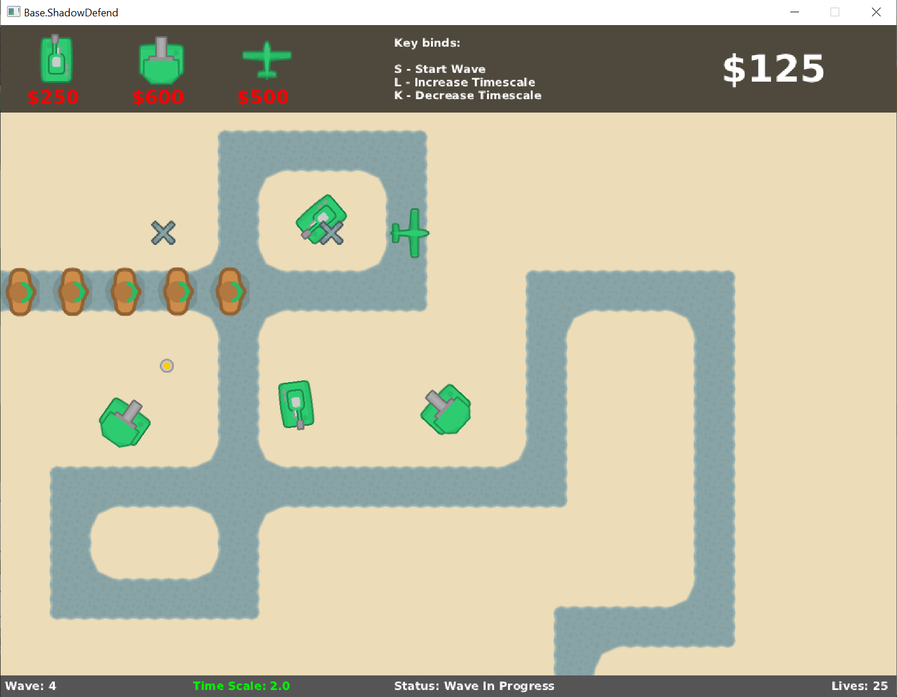

# Shadowdefend
ShadowDefend is a balloon tower defence based game. This project was created to practice object oriented programming fundamentals, such as inheritance, encapsulation, abstraction and polymorphism.

## How to play
1) Download the zip folder/clone it
2) Open in an IDE such as VS-Code or IntelliJ
3) Add bagel.jar into the "lib" folder as a project library
4) Run ShadowDefend.java file

* `To change the wave spawns, change the waves.txt file in res/levels`

## Demo

